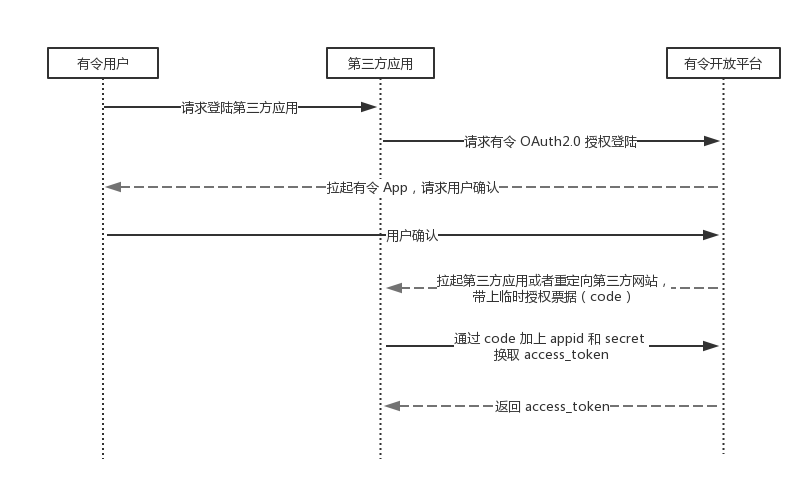
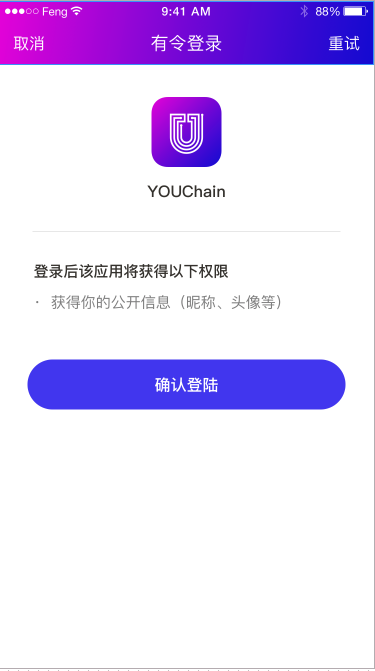

# 基本概念

有令开放平台授权登陆是基于 OAuth2.0 协议标准构建。

在进行有令授权接入前，请在开放平台中注册开发者账号，创建应用，获得 appid 和 appsecret，配置相关参数。

# 授权流程说明

整体流程如下：

```
1. 第三方发起授权在用户同意授权第三方应用之后，开放平台会拉起第三方应用或者重定向第三方网站，带上临时票据 code
2. 第三方应用通过 code 参数，带上 appid 和 appsecret，通过调用 API 换取 access_token
3. 第三方应用，通过 access_token 进行接口调用，获取用户信息和实现操作
```

如下图：



# 第一步：请求 code

### 引导用户打开如下页面

```
https://open.youchainapi.com/connect/oauth2/authorize?appid=APPID&redirect_uri=REDIRECT_URI&response_type=code&scope=SCOPE&state=STATE
```

参数说明：

| 参数        | 必须    |  说明  |
| --------   | -----:   | :----: |
| appid        | 是      |   应用的 appid    |
| redirect_uri        | 是     |   授权后重定向的链接地址，请使用 urlEncode 对链接进行处理，并保证与应用管理中心中的配置一致    |
| response_type        | 是     |   必须是 code     |
|scope|是|授权域，snsapi_base 可以获取 openid，snsapi_userinfo 可以获取用户基本信息|
|state|否|重定向后会带上state参数，开发者可以填写a-zA-Z0-9的参数值，最多128字节|

下图说明授权页面：



### 用户授权后

如果用户同意授权，页面将跳转至 redirect_uri/?code=CODE&state=STATE。

```
code 说明 ： code 作为换取 access_token 的票据，每次用户授权带上的 code 将不一样，code 只能使用一次，5 分钟未被使用自动过期。
```

### 错误说明

|错误号|说明|
| --- | --- |
|40000|appid 不能为空|
|40001|appid 错误|
|40002|app 状态错误|
|40003|redirect_uri 不能为空|
|40004|redirect_uri 域名与后台配置不一致|
|40005|scope 不能为空|
|40006|scope 不存在|
|40007|scope 错误|
|40008|response_type 不能为空|
|40009|response_type 必须是 code|

# 第二步：通过 code 换取 access_token

*注意，因为这一步涉及到 appsecret 的使用，十分重要，必须第三方的服务器中发起，同时开放平台也会有 ip 白名单的设置*

### 发起如下请求

```
GET
https://api.youchainapi.com/oauth2/access_token?appid=APPID&secret=SECRET&code=CODE&grant_type=authorization_code
```

参数说明：

| 参数        | 必须    |  说明  |
| --------   | -----:   | :----: |
| appid        | 是      |   应用的 appid    |
| secret        | 是     |   应用的 appsecret    |
| code         |是    |填写第一步获取的 code 参数|
| grant_type        | 是     |   必须是 authorization_code     |

返回说明：

正确返回时的 json 数据如下：

```
{
"access_token":"ACCESS_TOKEN",
"expires_in":7200,
"openid":"OPENID",
"scope":"SCOPE"
}
```

|字段|说明|
| --- | --- |
|access_token|调用此用户信息 API 的凭证|
|expires_in|access_token 接口调用凭证超时时间，单位（秒）|
|openid|用户唯一标识|
|scope	|用户授权的作用域|

错误返回，示例为 code 无效错误：

```
{"errcode":40029,"errmsg":"invalid code"}
```

### 错误说明

|错误号|说明|
| --- | --- |
|41001|appid 不能为空|
|41002|appid 错误|
|41003|code 不能为空|
|41004|code 不存在|
|41005|code 已使用过|
|41006|code 已过期|
|41007|secret 不能为空|
|41008|secret 错误|
|41009|grant_type 必须是 authorization_code|

# 第三步：拉取用户信息(需 scope 为 snsapi_userinfo)

请参考 [API 文档](api.md)
